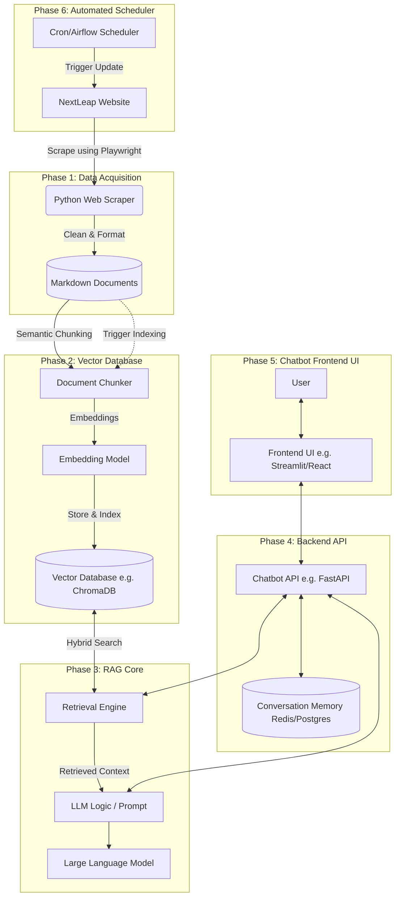

# NextLeap RAG Chatbot Architecture

This document details the phase-wise architecture for the NextLeap Retrieval-Augmented Generation (RAG) chatbot. The goal is to build a chatbot that can answer user queries regarding courses, curriculum hours, and instructors based on data fetched from the NextLeap platform.

## Architecture Diagram

## Phase-Wise Breakdown

### Phase 1: Data Acquisition (Completed)
*   **Objective:** Systematically extract structured data from the NextLeap website for the specified cohorts.
*   **Components:** Python scraper using `playwright` for JavaScript rendering and `beautifulsoup4` for HTML cleaning. Data is converted into pure Markdown using `markdownify` to ensure high compatibility with RAG indexing.
*   **Artifacts:** Cleaned Markdown files containing course details, curriculum, hours, and instructors.

### Phase 2: Vector Database & Indexing
*   **Objective:** Transform the raw Markdown data into searchable vectors.
*   **Components:** 
    *   **Chunker:** Split markdown text intelligently based on headers (e.g., separating instructors from weekly syllabus).
    *   **Embedding Model:** Create embeddings using a model like OpenAI's text-embedding models or HuggingFace.
    *   **Vector DB:** Store embeddings in ChromaDB or Pinecone with metadata tags.

### Phase 3: RAG Core & LLM Integration
*   **Objective:** Build the core logic that retrieves data and generates responses.
*   **Components:**
    *   **Retrieval:** Implement semantic search to find the most relevant chunks.
    *   **Generation:** Use **Groq** as the primary LLM for high-speed inference.
    *   **Strict RAG Policy:** The chatbot must only answer using the information stored in the embeddings. It is strictly prohibited from answering based on internal knowledge or "common sense" if the data is not present in the retrieved context.
    *   **Scope Control:** Any queries regarding personal information or topics not related to NextLeap courses/fellowships must be flagged as "out of scope" and not answered.
    *   **Citation:** Every response must include the source URL from which the information was retrieved.

### Phase 4: Backend API
*   **Objective:** Create a scalable API to serve the RAG core and manage chat state.
*   **Components:** 
    *   **Framework:** FastAPI to create RESTful endpoints or WebSockets for the chat stream.
    *   **Memory:** Connect to a lightweight database (like Redis) to store conversation history and manage user sessions.

### Phase 5: Chatbot Frontend UI
*   **Objective:** Provide an interface for users to interact with the bot.
*   **Components:** A clean conversational UI (e.g., Streamlit for rapid prototyping, or a custom React/Next.js interface) that connects directly to the Backend API.

### Phase 6: Automated Scheduler
*   **Objective:** Ensure the chatbot's knowledge base is always up-to-date.
*   **Components:** 
    *   **Scheduler:** A task scheduling system (e.g., Cron jobs, Celery, or Apache Airflow) that runs weekly or daily.
    *   **Workflow:** Triggers the scraper (Phase 1), diffs the results, and if changes are found, automatically runs the Document Chunker and Vector DB ingestion (Phase 2) to refresh the data without manual intervention.

### Phase 7: Deployment (Deferred)
*   **Objective:** Deploy the full application to production.
*   **Components:** Cloud hosting for the Vector DB, backend API (FastAPI), and frontend UI (Vercel/AWS).
